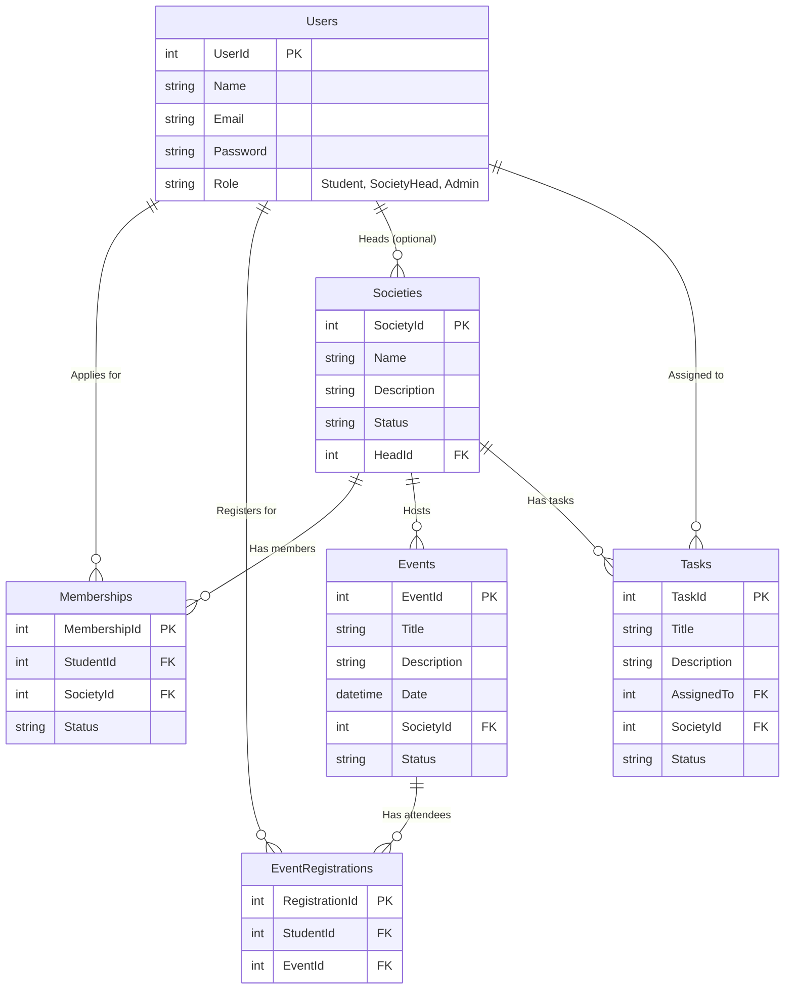

# FAST Societies Management System - Project Report

## System Overview
The FAST Societies Management System is a desktop application developed using C# Windows Forms and SQL Server. It automates society registrations, event management, and administrative oversight. The system features Role-Based Access Control to serve Students, Society Heads, and University Administrators.

## Delivered Components
### 1. Database Schema (`Schema.sql`)
The complete schema includes tables for `Users`, `Societies`, `Memberships`, `Events`, `EventRegistrations`, and `Tasks`. It establishes relationships with foreign keys to ensure data integrity and sets up default statuses for approval flows.

### 2. Application Code
- **Models**: `User`, `Society`, `Membership`, `Event`, `EventRegistration`, `SocietyTask`, and `Session` for state management.
- **Services**: 
  - `AuthService` for Login/Register.
  - `SocietyService` for browsing and managing societies.
  - `MembershipService` for joining and approving members.
  - `EventService` for creating, approving, and registering for events.
- **Forms/UI**:
  - `LoginForm`, `RegisterForm`
  - `DashboardForm` with dynamic sidebar based on the logged-in user role.
  - **Student**: `SocietyForm`, `MyMembershipsForm`, `UpcomingEventsForm`, `MyTicketsForm`.
  - **Society Head**: `ManageMembershipsForm`, `ManageEventsForm`.
  - **Admin**: `ManageUsersForm`, `ManageSocietiesForm`, `ApproveEventsForm`.

## Entity Relationship Diagram (ERD)

## How to Run
1. Run the `Schema.sql` script in SQL Server Management Studio to create the `SocietiesDB` database and insert initial test data.
2. Ensure your SQL Server connection string in `Data/DbHelper.cs` is correct for your local environment.
3. Build and run the project using Visual Studio or `dotnet run`.
4. Log in using the initial data provided in the schema (e.g., `admin@fast.edu` / `admin123` for Admin).
